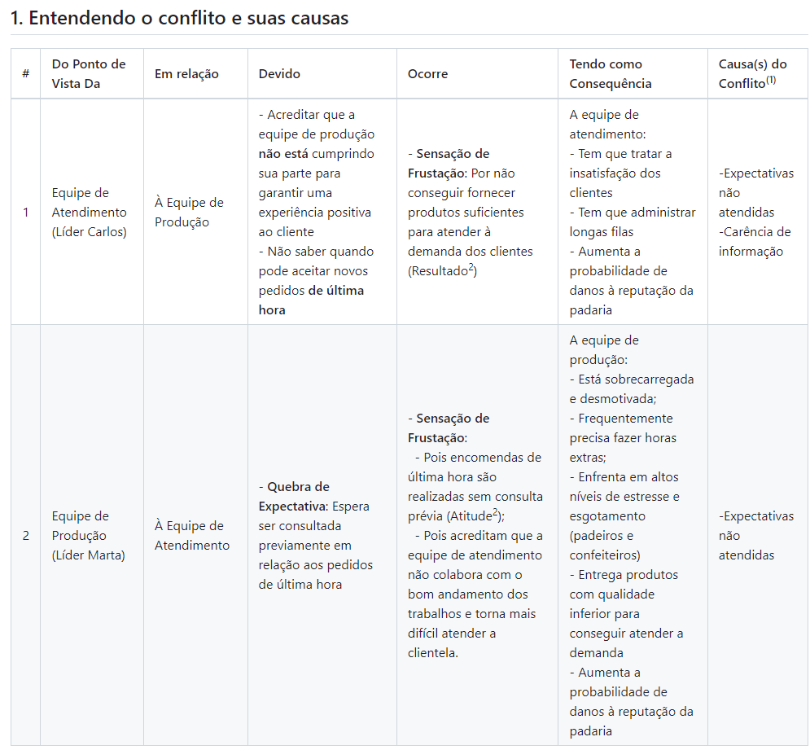

## Estratégias de Negociação

### Atividade da Disciplina

#### Professor: Leandro Cerutti

##### Membros:

Rita de Cássia Ramos Pereira (5117483)
Kailane dos Santos de Oliveira (5206020)
Irenilde Andrade dos Santos (6227205)
Daniel de Lima Claudino (5226938)

---

## 1. Identificação das Causas do Conflito

- Expectativas não atendidas
- Carência de informação
- Rivalidade entre equipes

---

---
## 2. Proposta de solução para o Conflito

Considerando as causas do conflito, opta-se em adotar o **estilo de gestão de conflito** com **abordagem de processo**, conforme orientado por Chiavenato (2008 apud SILVA, 2023, p. 71), tendo em vista que essa abordagem procura amenizar um conflito de três formas que serão implementadas como **proposta de solução** para o conflito em tela:

1) **Reunião entre as partes**: Onde serão abertos os motivos do conflito de maneira mais direta entre os envolvidos;
2) **Desativação do conflito**, onde uma das partes opta pela cooperação promovendo o acordo;
3) **Colaboração**, que ocorre após passadas as etapas anteriores, com as duas partes buscando uma resolução vantajosa para todos.

---
## 2.1 Técnica de Negociação Escolhida

- Segundo Silva (2023, p. 79-82), os principais **MÉTODOS** adequados de solução de conflitos são: **Negociação**, **Autocomposição**, **Conciliação**, **Mediação** e **Arbitragem**;
- A escolha sobre qual método adotar deve considerar uma série de **FATORES**, como tipo de disputa,vínculo entre as partes, nível de conflito etc.
- Para o caso em questão, optou-se em utilizar a **CONCILIAÇÃO**:
  - A conciliação é uma técnica utilizada na resolução de disputas em que há a figura de um terceiro, “o conciliador”, responsável por escutar as partes a fim de estimulá-los a chegarem num acordo. O conciliador sugere e propõe soluções para o conflito, cabendo às partes aceitarem ou não essa proposta
  - A **CONCILIAÇÃO** será implementada na fase "**DESATIVAR CONFLITO**" do plano de ação a ser apresentado.

---

## 3.1 Plano de Implementação de Solução

- Para implementação da proposta de solução apresentada no slide anterior, será adotado um plano de ação seguindo a metodologia 5W2H;

---

---
## 3.2 Atividades do Plano de Ação (Cronograma: O que? e Quando ?)

<b>Plano de Ação: </b> nome-do-plano-de-ação

<b>Fase</b>: Reunião
<ol>
<li> <b>O que ?</b> Elaborar material para reunião  <b> Quando ?</b>Em até 5 dias úteis</li>
<li> <b>O que ?</b> Reservar sala de reunião <b> Quando ?</b> Em até 1 dia útil</li>
<li> <b>O que ?</b> Comunicar convocação para reunião <b>Quando ? </b> Em Até 2 dias úteis</li>
<li> <b>O que ?</b> Realizar reunião <b>Quando ? </b> Dentro de 5 dias úteis, no máximo</li>
</ol>

<b>Fase</b>: Desativar Conflito
<ol start="5">
<li> <b>O que ?</b> Identificar e detalhar atividade(s) críticas do processo de trabalho <b>Quando ? No dia da reunião </b></li>
<li> <b>O que ?</b> Identificar e detalhar expectavivas das atividade(s) críticas do processo de trabalho <b>Quando ? No dia da reunião </b></li>
<li> <b>O que ?</b> Homologar expectativas e detalhes das atividades <b>Quando ? No dia da reunião</b></li>
</ol>

---
## 3.2 Atividades do Plano de Ação (Cronograma: O que? e Quando ?)

<b>Fase</b>: Colaboração
<ol start="8">
<li> <b>O que ?</b> 1º Aferição das métricas<b> Quando ?</b> 15 dias após a reunião</li>
<li> <b>O que ?</b> 2º Aferição das métricas<b> Quando ?</b> 45 dias após a reunião</li>
<li> <b>O que ?</b> 3º Aferição das métricas<b> Quando ?</b> 60 dias após a reunião</li>
<li> <b>O que ?</b> Reunião de apresentação dos resultados e aferição dos benefícios<b> Quando ?</b> Após a 3º aferição das métricas</li>
<li> <b>O que ?</b> Coffe-break de confraternização<b> Quando ?</b> Após a reunião de apresentação dos resultados</li>
</ol>

---

## 4. Métricas

A fim de averiguar o sucesso da **proposta de solução apresentada**, serão estabelecidas as **métricas de sucesso** abaixo:

- Tempo de espera em minutos em fila
- Satisfação no atendimento
- Satisfação dos colaboradores

---

## 5. Benefícios

Um vez concluído o **plano de ação** e aferidas as **métricas de sucesso** estabelecidas, será possível verificar o alcance dos seguintes **benefícios** para a organização:

- Solução do conflito entre equipes de atendimento e produção;
- Capacidade de produção definida e comunicada previamente entre as equipes de atendimento e produção;
- Capacidade de entrega comunicada de forma clara e tempestiva;
- Aumento da satisfação dos clientes;
- Filas de tamanho mínimo e aceitáveis;
- Motivação das equipes de atendimento e produção;
- Volume de horas extras estimadas comunicadas as equipes previamente;
- Qualidade de vida no trabalho;
- Manutenção do padrão de qualidade e excelência nos produtos entregues aos clientes;

---

  Muito Obrigado !!!

 Referências:   <b>SILVA, Liliane de S. Vieira. **Estratégias de Negociação**. Indaial:Uniasselvi, 2023</b>