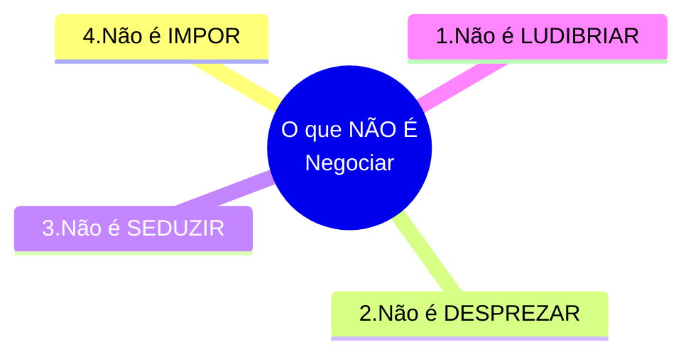
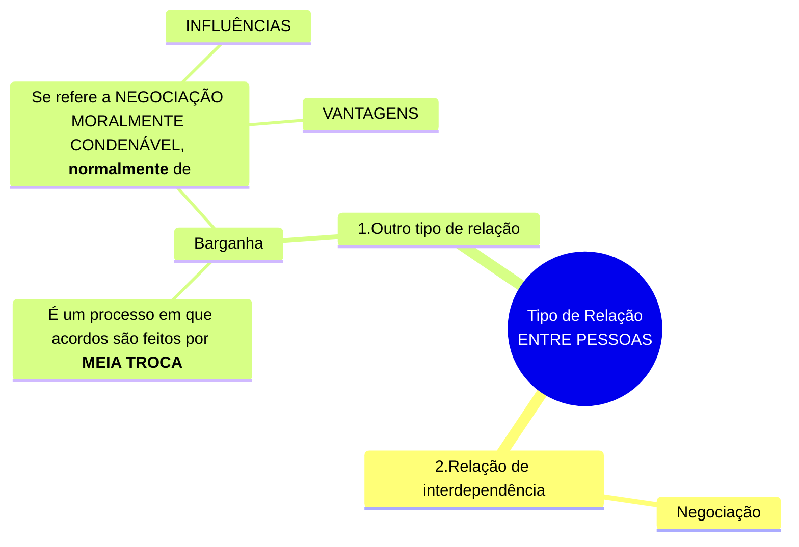

# Capítulo 01 - Introdução: Negociar é preciso

## Objetivos do capítulo

## Introdução - Inicie sua jornada

- A negociação como área de estudo compreende as técnicas, abordagem e estratégias utilizadas em negociações, mas também está relacionada à comunicação, inteligência emocional e argumentação.

## Negociação

- Uma das **cinco categorias** de prêmio Nobel, desde 1901;
- Exemplos de situações relevantes que envolveram a solução de conflitos:
  - Em 1981, nos Estados Unidos, também foi a greve dos controladores de voo.
  - Em 2018, no Brasil, Greve dos caminhoneiros, também chamada de Crise do Diesel;
- A **importância das negociações** está além de apenas transações comerciais, sendo utilizada para manter:
  - a ordem;
  - a segurança;
  - a fluidez da economia;
  - a paz; e
  - a vida 

### A Possibilidade de Negociação: A conto do "Julgamento Injusto"

- O conto abaixo trás a seguinte reflexão:
  - Da possibilidade de negociação;
  - De situações em que ela não é possível; ou até mesmo 
  - De casos em que é impossível não negociar

**A CONTO DO "JULGAMENTO INJUSTO"**  
Um homem foi injustamente acusado de ter assassinado uma mulher.  
O verdadeiro autor do crime era uma pessoa influente no reino, e por isso desde o primeiro momento se procurou um “bode expiatório” para acobertar o assassino.  
O homem acusado foi levado à julgamento.  
O resultado já era sabido por todos: a forca.  
Ele sabia que tudo iria ser feito para condená-lo e que teria poucas chances de sair vivo dessa história.  
O juiz, que também estava combinado para levar o pobre homem à morte, simulou um julgamento justo, fazendo uma proposta ao acusado. Disse o juiz:  
Sou de uma profunda religiosidade e por isso vou deixar sua sorte nas mãos do Senhor, vou escrever num pedaço de papel a palavra INOCENTE e no outro pedaço a palavra CULPADO.  
Você irá sortear um dos papéis e aquele que sair, será o veredicto.  
O Senhor decidirá seu destino! – determinou o juiz.  
Sem que o acusado percebesse, o juiz preparou os dois papéis, mas em ambos escreveu CULPADO, de maneira que naquele instante não existia nenhuma chance do acusado se livrar da forca.  
Não havia alternativas para o homem.  
O juiz colocou os dois papéis em uma mesa e mandou o acusado escolher um.  
O homem parou por alguns instantes, pensou e aproximou-se da mesa desconfiado.  
Pegou um dos papéis e rapidamente colocou-o na boca e engoliu.  
Os presentes no julgamento reagiram surpresos e indignados com a atitude do homem.  
Mas o que você fez? E agora? Como vamos saber qual será seu veredicto?  
Não será difícil! – respondeu o homem.  
Basta olhar o outro pedaço de papel que sobrou e saberemos que acabei engolindo o contrário.  

- FONTE: <https://radio93.com.br/eraumavez/o-homem-e-a-forca/>. Acesso em: 8 jun. 2021

## Bases conceituais da negociação

<b>Figura:</b> A negociação

<table align="center" width="650" id="nome-id-unico">
  <tr>
    <td align="center">
       
    </td>
  </tr>
</table>

<b>Fonte:</b> Imagens do google

#### O que NÃO É negociar

#### O que É negociar: Tipo de Relação entre Pessoas e a Negociação 

- **Fisher e Ury, (1985, p. 30)** afirmam que
  - A **NEGOCIAÇÃO**
    - É um **processo** de **COMUNICAÇÃO BILATERAL**;
    - Tem por **OBJETIVO** de se chegar a uma **DECISÃO CONJUNTA**.
- De acordo com <b>JUNQUEIRA (1988, p. 5)</b>:
  - **NEGOCIAÇÃO**
    - É o **PROCESSO** de **BUSCAR A ACEITAÇÃO**:
      - De ideias;
      - De propósitos; ou
      - De interesses
    - É um **PROCESSO** que <b>**VISA** ao **MELHOR RESULTADO POSSÍVEL**, **DE TAL MODO QUE**</b>:
      - <b>As partes envolvidas</b> **TERMINEM A NEGOCIAÇÃO**:
        - Conscientes de que <b>foram ouvidas</b>;
        - Concientes que <b>tiveram oportunidades de apresentar toda sua argumentação</b>;
        - Concientes que o <b>produto final</b> seja maior que a <b>soma das contribuições individuais</b>;
- Para **Brett (2000)**:
  - **NEGOCIAÇÃO**
    - É uma **FORMA DE INTERAÇÃO SOCIAL**;
    - É um processo em que duas ou mais partes tentam solucionar **METAS PERCEBIDAS** como **incompatíveis**;
- Para **Sobral, Carvalho e Almeira (2007)**:
  - Sendo uma **INTERAÇÃO SOCIALMENTE MOTIVADA** entre indivíduos ou grupos com interesses divergentes e comuns, a **NEGOCIAÇÃO** promove o confronto entre diferentes:
    - Valores;
    - Visões; e
    - Perspectivas do mundo
- Para **Accuf (2004, p. 28)**
  - **NEGOCIAR** é um **PROCESSO**
    - De **COMUNICAÇÃO** de **mão dupla**;
    - Cujo **OBJETIVO**
      -  É chegar a um **ACORDO MÚTUO** sobre
         - Necessidades divergentes;
         - Opiniões divergentes;
       - É **persuadir** ao invés de usar a força bruta;
     - Que culmina com o **outro lado** sentindo-se **satisfeito** como o **resultado da negociação**;
- **PERSUADIR**
  - Significa **CONDUZIR** alguém a:
    - CRER numa ideia ou proposta
    - ACEITAR uma ideia ou proposta
  - Significa **CONVENCER**
- **PODER DE PERSUASÃO**
  - É uma **habilidade fundamental** a todo negociador;
  - Soluciona conflitos
    - Por meios concensuais
    - Poupando tempo
    - Poupando custos
- Para **Benjamin (2012)**
  - Quem faz uso das **TÉCNICAS DE NEGOCIAÇÃO** são mais
    - Flexíveis;
    - Eficientes;
    - Econômicos
- A **NEGOCIAÇÃO**
  - É um PROCESSO SOCIAL presente no cotidiano de todo indivíduo;
  - É parte fundamental das **atividades do dia a dia** de executivos, diretores, líderes e gestores no âmbito organizacional
- Para **Thompson (2005)** existem **CINCO RAZÕES-CHAVE** para a **IMPORTÂNCIA DA NEGOCIAÇÃO** no âmbito organizacional:
  - **NATUREZA DINÂMICA DO NEGÓCIOS**: 
    - Mobilidade, flexibilidade e dinamismo.
    - As pessoas têm que continuamente criar possibilidades, integrar os seus interesses com os dos outros e reconhecer a permanente concorrência dentro e entre as empresas.
  - **INTERDEPENDÊNCIA**:
    - Crescente interdependência das pessoas dentro das organizações, hierárquica e funcionalmente;
    - As pessoas tem que saber integrar os seus interesses e trabalhar em conjunto nas várias unidades de negócio e áreas funcionais.
    - O grau crescente de especialização e conhecimento do mundo empresarial implica que as pessoas estejam cada vez mais dependentes de outros, no fornecimento de partes de um serviço ou de um produto completo.
    - Os gestores necessitam de saber promover os seus próprios interesses.
  - **COMPETIÇÃO**:
    - As grandes empresas afirmam-se como grandes atores nos maiores mercados, conseguindo **economias de escala** e **grandes lucros**;
    - Os grandes serão cada vez maiores e muitos pequenos correrão o risco de desaparecer;
    - Empresas devem ser peritas em **ambientes competitivos**, e **saber navegar neste ambiente** é fundamental para negociar com sucesso.
  - **ERA DA INFORMAÇÃO**:
    - A era da informação traz também oportunidades e desafios para o gestor enquanto negociador;
    - A **velocidade** e a **disponibilidade** **da informação** levam a que os gestores tenham que estar preparados para **negociar em cima do acontecimento**, no momento certo.
    - A era da informação amplia a capacidade das empresas para **criar valor** para os seus clientes
  - **GLOBALIZAÇÃO**:
    - Comunicar e negociar junto de pessoas de diferentes nacionalidades, estratos e estilos de comunicação é um desafio primordial para os gestores.
- **Para Boff (2011, p. 112)**:
  - Todos os profissionais negociam com seus clientes internos, externos, líderes e liderados;
  - Todos os profissionais negociam:
    - Recursos humanos;
    - Recursos financeiros;
    - Prazos;
    - Orçamentos;
    - Contratos;
    - Dentre tantas outras coisas.
- Para **Pollan e Levine (1994, p. 6)**:
  - A **NEGOCIAÇÃO** é, depois de ler e escrever, é a habilidade mais importante e necessária para alguém se tornar bem-sucedido **pessoalmente**, **financeiramente** e **nos negócios**.
- **Para Mintzberg (1973, p. 91)**:
  - Embora **possa até ser** classificada por muitos como **um trabalho não gerencial**, **trata-se de uma parte vital da função de um administrador**.

### O termo NEGOCIAÇÃO

- segundo **Rosalem e Santos (2007):**
  - O termo deriva do latim *negocium*, palavra formada pela junção dos **termos** *nec* (nem, não) + *ocium* (ócio, repouso);
  - Negociar significa **negar o** **ÓCIO**;
- Seu **uso mais frequente**, tanto no latim quanto no português, gira em torno de comércio, relações comerciais, transação, combinação, ajuste;
- O termo está associado à estratagema ou truque para ganhar dinheiro com facilidade, oportunidade;
- No inglês, o **termo equivalente NEGOCIATE** tem apenas o significado de **transação comercial**.
- A negociação como campo de conhecimento vem sendo explorado por diversas áreas de estudo, como Direito, Administração, Engenharia, Marketing, Secretariado;
- **Godinho e Macioski (2005, p. 144)** afirmam que:
  - Nas escolas de negócios e de direito, **novas disciplinas têm sido criadas** contemplando o **estudo das técnicas de influenciar as pessoas**, ensinando os futuros profissionais a:
    - Discutir preços;
    - Normas;
    - Cláusulas e acordos;
    - Persuadir;
    - Conceder;
    - Intimidar; e
    - Blefar.
- **Teixeira, Fialho e Silva (2011)** apontam que:
  - A palavra negociação é bastante conhecida;
  - O assunto “negociação” ainda é pouco desenvolvido no meio acadêmico, com muita pouca **teoria e conceitos definidos**.

### Aspectos presentes na NEGOCIAÇÃO

- Martinelli (2001) fez um levantamento de **14 definições** do **tema NEGOCIAÇÃO**, referentes a **11 autores** distintos.
  - Os principais aspectos que caracterizam os conceitos de negociação estão apresentados no Quadro abaixo:

|Autor|Aspectos que caracterizam a **NEGOCIAÇÃO**|
|:---:|:---|
|Cohen (1980)|Obter vantagens|
|Cohen (1980)|Uso da informação e do poder|
|Nierenberg (1981)|Relacionamento humano|
|Fisher & Ury (1985)|Importância da comunicação|
|Matos (1989)|Busca de interesses comuns|
|Matos (1989)|Importância da participação no processo|
|Steele att ali (1989)|Movimento de posições divergentes para um acordo|
|Steele att ali (1989)|Uso da barganha no processo|
|Acuff (1993)|Busca de um acordo|
|Mills (1993)|Negociamos sempre|
|Gibbons & Mc Govern (1994)|Importância da flexibilidade|
|Hodgson (1996)|Instrumento da satisfação das necessidades|
|Robinson (1996)|Negocia-se desde o dia em que se nasce|
|Lewick et al. (1996)|Negociação estratégia|

### Abordagens da negociação

- Recentemente, pesquisas surgiram sobre a temática possuindo seu **FOCO** na **riqueza** e **complexidade** das negociações;
- Estabelece-se diferentes **PERSPECTIVAS ou ABORDAGENS TEÓRICAS** com **VISÕES** diferentes do **PROCESSO DE NEGOCIAÇÃO** **(BELL; RAIFFA; TVERSKY, 1989 apud PAULA; SOUZA, 2007)**:
  - Abordagem NORMATIVA das negociações;
  - Abordagem DESCRITIVA das negociações;
  - Abordagem PRESCRITIVA das negociações;

#### Abordagem NORMATIVA das Negociações

- Acupa-se em **MODELAR O PROCESSO** <u>assumindo</u> um **comportamento racional** dos negociadores;
- **FOCO DO ESTUDO NORMATIVO**:
  - É a elaboração de **modelos formais da negociação** que, <u>a partir da hipótese</u> de **RACIONALIDADE DOS NEGOCIADORES**, podem ser usados para facilitar a obtenção de **COMPROMISSOS ESTÁVEIS E EFICIENTES**;

#### Abordagem DESCRITIVA das Negociações

- O **OBJETIVO**:
  - É prescrever o comportamento dos negociadores, de maneira que eles alcancem
    - Bons resultados durante a negociação; e
    - Excelência no processo
- Normalmente, é a abordagem **CONSIDERADA POR**:
  - Cientistas comportamentais;
  - Historiadores;
  - Psicólogos;
  - Sociólogos;
  - Antropólogos;
  - Cientistas políticos.
- O **FOCO** é:
  - Na descrição e análise das **PERCEPÇÕES** dos negociadores;
  - Na descrição e análise do **COMPORTAMENTO** dos negociadores;
  - Nas **IMPLICAÇÕES NO PROCESSO** e nos **RESULTADOS OBTIDOS**.
- São discutidas, nessa abordagem:
  - Diferenças individuais;
  - Influências sociais; e
  - Influência do ambiente.

#### Abordagem PRESCRITIVA das Negociações

- O **FOCO** é:
  - Nos **ASPECTOS COMPORTAMENTAIS** do negociador;
  - Na **FORMA** como as decisões são tomadas efetivamente
- O **OBJETIVO** é:
  - A busca dos pesquisadores em **ENTENDER** e **DESCREVER**
    -  **ASPECTOS COMPORTAMENTAIS** do negociador;
    -  **FORMA** como as decisões são tomadas efetivamente
  - É **DESENVOLVER TÉCNICAS** que **direcionam os negociadores** na <u>**maneira como eles devem se comportar**</u>. 

#### Quatro Aspectos que Caracterizam as Negociações

- Segundo **Lewicki, Saunders e Barry (2014, p. 3)**:
  - A <b>**NEGOCIAÇÃO**</b> é <b>**UMA FORMA DE TOMADA DE DECISÃO**</b> na qual duas ou mais partes discutem um assunto no esforço de resolver as diferenças relativas a seus interesses”. Segundo os autor, há quatro pontos caracterizam as negociações:

1. Toda e qualquer negociação envolve **DUAS** ou **MAIS** **partes interessadas**
2. Em toda negociação existe um conflito de interesses
   - O **CONFLITO** pode ocorrer quando:
     - As partes desejam a mesma coisa.
       - P. ex: Dois grupos em um setor desejam entrar de férias no mesmo período, sendo que um grupo deve ficam trabalhando para cumprir as normas de gestão de pessoas;
     - As partes desejam coisas diferentes.
       - P. ex: Dois setores desajam executar um mesmo trabalho que deve ser realizado em conjunto em tempos diferentes;
3. As partes negociam deliberadamente
   - Usam argumentos para convencer a outra parte;
   - Evocam benefícios;
   - Tentam convencer o que a outra parte pode obter. 
4. Quando o processo de negociação ocorre, as partes envolvidas esperam, em troca do que dão, receber aquilo que desejam e que acham ser justo com **DUAS POSSIBILIDADES DE RESULTADO**:
   - ou **HÁ NEGOCIAÇÃO**;
   - ou não **HÁ NEGOCIAÇÃO**:
     - Quando não há, as partes podem perder.

Em 12/11/2023, 10:43, eu parei na página 12 do livro.

## (...)

(...)

## Referências bibliográficas
