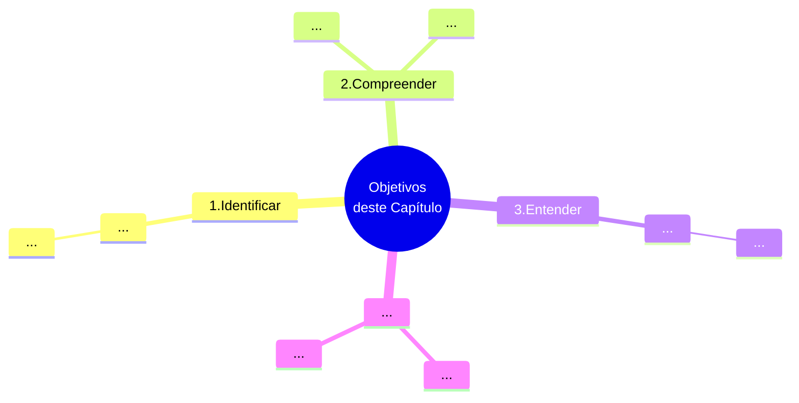

# Capítulo 01 - Introdução: Negociar é preciso

## Objetivos do capítulo

## Introdução - Inicie sua jornada

## -

### --

  
<table id="nome-id-unico">
  <tr>
    <td align="center" width="140px">
       
      <b>Lembre-se</b>
    </td>
    <td valign="top">
      Nesta seção, é preciso lembrar que antes da organização definir OBJETIVOS, ela define uma FINALIDADE. Desse modo, convém sempre ter em mente que a organização define seus objetivos, sempre alinhados não só com as necessidades e oportunidades que existem, mas também com sua finalidade.
    </td>
  </tr>
</table>

## Novos desafios
  
## Fontes de Informações

(...)

## Referências bibliográficas
