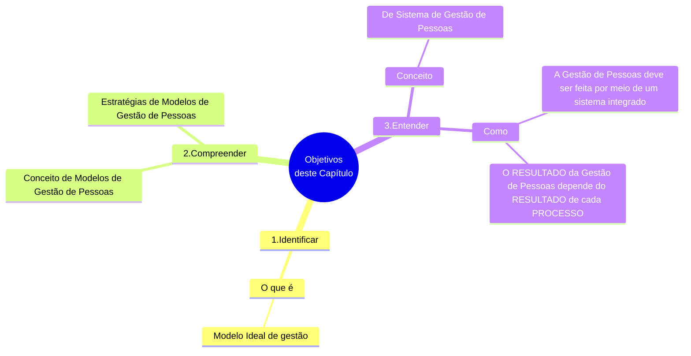
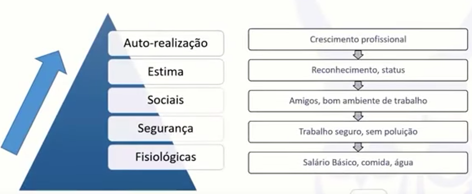

# Capítulo 01 - Gestão de Pessoas e Suas Atividades Básicas

## Objetivos do capítulo

## Introdução

- Gerir pessoas é:
  - **aproveitar as melhores habilidades** de cada um;
  - **motivar pessoas** para alcançarem um objetivo(s) comum(ns);
- De qualquer grupo social exerga-se a **importância** e surge a **preocupação** de **coordenar a capacidade de trabalho das pessoas**;
- Nos últimos 100 anos, a **preocupação** de **coordenar a capacidade de trabalho das pessoas** ganhou **teorias** e **estudos** especificos;
- Ambiente econômico mais complexo:
  - Empresas cada vez:
    - Maiores;
    - Numerosas;
    - Diversas;
  - Dificuldade de gerir pessoas de maneira intuitiva ou amadora;
  - Surgimento da **Gestão de Pessoas** como um **campo específico** de **atuação** e **pesquisa**;
    - Existe um **conjunto de atividades** <u>relacionadas às pessoas</u> que compõe a organização;
- **NÃO HÁ ORGANIZAÇÃO** <u>sem pessoas</u>;
- O **desempenho das pessoas** **OSCILA** na medida em que a **ORGANIZAÇÃO** demonstra:
  -  **COMPETÊNCIA** para:
     - **Prover** pessoas;
     - **Aplicar** pessoas;
     - **Manter** pessoas;
     - **Desenvolver** pessoas; e
     - **Monitorar** pessoas;
  - **ATIVIDADES DE GESTÃO** relacionada com a atividade de lidar com pessoas, respeitando suas características:
    - Físicas;
    - Psicológicas;
    - Culturais;
    - Sociológicas.

> "O **desempenho organizacional** é diretamente afetado pelo **desempenho das pessoas**.  
>  &nbsp;O **desempenho das pessoas** é diretamente relacionado com a forma que que a **organização** se relaciona com elas".

## Formulação estratégica de um modelo de gestão de pessoas

- Entende-se como certo, neste século, que **CRESCERÁ**:
  - A **INTERDEPENDÊNCIA** dos indivíduos;
  - A **INTERDEPENDÊNCIA** das organizações;
  - A **INTERDEPENDÊNCIA** na sociedade;
- A sociedade enfrentará **exigências** cada vez mais **crescentes** em atender **necessidades** cada vez mais **numerosas e complexas**;
  - A sociedade enfrentará **exigências** de atender a **um maior número** de necessidades cada vez mais **numerosas e complexas**;
  - A sociedade enfrentará **exigências** de atender de **novas formas** necessidades cada vez mais **numerosas e complexas**;
- A sociedade como um todo responderá a esses **desafios** (**necessidades** cada vez mais **numerosas e complexas**) através de uma das invenções humanas mais criativas: **AS ORGANIZAÇÕES**:
  - As **ORGANIZAÇÕES** estebelecem **OBJETIVOS**:
    - Para enfrentar **AS NECESSIDADES** da sociedade;
    - Para enfrentar **OS DESAFIOS** da sociedade;
  - As **ORGANIZAÇÕES** alcançam objetivos pelo **USO DE RECURSOS**;
  - As **ORGANIZAÇÕES** precisam **USAR SEUS RECURSOS** de modo mais eficiente possível (**MELHORAR AS ORGANIZAÇÕES**);
  - Quanto **melhor as ORGANIZAÇÕES funcionarem**, mas facilmente nossa sociedade poderá enfrentar os **desafios** e as **oportunidades** deste e dos próximos séculos;
  
<table id="nome-id-unico">
  <tr>
    <td align="center" width="140px">
       
      <b>Lembre-se</b>
    </td>
    <td valign="top">
      Nesta seção, é preciso lembrar que antes da organização definir OBJETIVOS, ela define uma FINALIDADE. Desse modo, convém sempre ter em mente que a organização define seus objetivos, sempre alinhados não só com as necessidades e oportunidades que existem, mas também com sua finalidade.
    </td>
  </tr>
</table>

- Existem muitas formas de efetuar a **Gestão de Pessoas** nas organizações;
- Poucos **modelos de Gestão de Pessoas** são introduzindos nas organizações à luz de uma **diretriz estratégica**;
- A **Gestão de Pessoas** surgiu, inicialmente, para:
  - Cumprimento de leis trabalhistas;
  - Adotar medidas de controle (principalmente, disciplinares);
- Um **BOM MODELO DE GESTÃO DE PESSOAS** significa:
  - Adotar **uma estratégia** de gestão de pessoas;
  - Adotar **uma estrutura** de gestão de pessoas;
  - Adotar **um sistema** de gestão de pessoas;
- **Organizações bem geridas** são aquelas que **adotam modelos apropriados** para a **gestão de todos os recursos**, <u>inclusive para a Gestão de Pessoas</u>;
- Geralmente, **MODELOS DE GESTÃO** são adotados a partir de definições estratégicas;
  - Devem ser adotados de forma:
    - A levarem as pessoas a conhecerem os **OBJETIVOS ESTRATÉGICOS DA ORGANIZAÇÃO**;
    - A dominarem técnicas de trabalho
    - A saberrem onde e como prover melhorias
    - A identificarem sua contribuição para os resultados finais;
    - A compreenderem os impactos produzidos por sua atuação;

São **REQUISITOS** de um **modelo de gestão de pessoas** **BEM DEFINIDO** e **BEM ESTRUTURADO** requer:

1. Definição dos **objetivos** estratégicos da gestão de pessoas;
2. **Domínio e utilização das técnicas** específicas para a Gestão de Pessoas;
3. Quem **sejam conhecidas** as **metodologia** apropriadas para **melhorias contínuas** relacionadas à Gestão de Pessoas;
4. Quem **sejam conhecidas** as oportunidades para **melhorias contínuas** relacionadas à Gestão de Pessoas;
5. Que seja possível a **identificação clara e objetiva** da **contribuição da gestão de pessoas** para os **resultados finais da organização**;
6. Que haja **compreensão dos impactos** produzidos pela **atuação da gestão de pessoas** em **toda a organização**;

Um **modelo de gestão de pessoas** **BEM DEFINIDO** e **BEM ESTRUTURADO** auxilia os responsáveis pela organização para o grande desafio de manter os colaboradores trabalhando:

- Como uma verdadeira equipe;
- Com objetivos bem definidos;
- Cada qual conhecendo e desempenhando o seu papel
- Interagindo com todos os processos da organização;
- Para atingir os objetivos previstos pelo plano estratégico
- A fim de que a organização passe a percenter ao grupo de organizações no futuro;
  
## Modelo de gestão de pessoas ideal

- Por **modelo de gestão de pessoas** entende-se não um modelo ao qual todas as organizações devam seguir e que foi copiado, mas um modelo que nasce do **encontro entre os interesses** da **organização** e dos seus **colaboradores**.
- Um **modelo ideal**:
  - Leva a organização como um todo e seus colaboradores a alcançarem os **resultados desejados**;
  - Considera as **atitudes** que atendam aos desejos de todos;
- Existem **desejos comumente aceitos** em ambientes organizacionais:
  - Valorização;
  - Reconhecimento;
  - Crescimento;
  - Desenvolvimento pessoal;
  - Desenvolvimento profissional;
  - Justiça
  - Equidade;
  - Ambiente de trabalho digno;
  - Ambiente de trabalho organizado;
  - Redução de desperdícios;
  - Aumento da produtividade;
- A **falta de conhecimento** impede a organização de **visualizar os resultados** que de fato podem ser obtidos para o **crescimento** e o **desenvolvimento** das pessoas e das organizações;

<table id="ID-REFLEXAO-FALTA-DE-CONHECIMENTO">
  <tr>
    <td align="center">
       
      <b>Reflexões</b>
    </td>
    <td valign="top">
    <ul>
    <li>Não é sempre que a Gestão de Pessoas é verdadeiramente praticada nas organizações. Principalmente, mas não exclusivamente, nas de pequeno e médio porte</li>
    <li>Acaba sendo entendida como um centro de despesas, e não de investimentos.</li>
    </ul>
   
Questiona-se se, verdadeiramente, é <b>APENAS</b> <b>falta de conhecimento</b> que impede a organização de <b>visualizar os resultados</b> que podem ser obtidos com a <b>gestão estratégica de pessoas</b>

   
A <b>cultura organizacional</b> e <b>fatores políticos internos organizacionais</b> podem influenciar ou até mesmo determinar mais essa realidade do que a simples falta de conhecimento.

    </td>
  </tr>
</table>

- A adoção de um modelo de Gestão de Pessoas deve ser uma decisão estratégica da organização;
- Um modelo de gestão de pessoas, seja ele bem ou mal estruturado, **interfere positiva ou negativamente** nas **vidas das pessoas e da organização**, <u>na medida em que</u> **os desejos são ou não atendidos**;
- Um modelo de Gestão de Pessoas adotado, bem ou mal estruturado, é fortemente influenciado pela:
  - Características da organização;
  - Estrutura da organização;
  - Tamanho da organização;
  - Tipo de atividade;
  - Diferentes fases de sua evolução;
  - Cultura organizacional;
- A Gestão de Pessoas
  - Tem um impacto crucial na **competitividade**,**sobrevivência** e **perpetuação** da organização;
  - Quem pode fazer isso são pessoas **qualificadas**, **motivadas**, de **alto desempenho**;
- O **desenvolvimento organizacional**, em termos de **lucratividade** e **participação no mercado**, é possível e mais fácil de ser medido objetivamente, já o **desenvolvimento das pessoas** <u>é mais complexo</u>.

## As responsabilidades pela Gestão de Pessoas

- A Gestão de Pessoas como uma **função de staff** — grupo qualificado de pessoas que assistem a um dirigente ou a um chefe —, 
- O **dirigente** atua estrategicamente em todas as atividades da Gestão de Pessoas;
- As **pessoas que assistem ao dirigente** são as que administram o pessoal de fato (gerente ou chefe), ou seja,
  - Decidem sobre:
    - Novas admissões;
    - Promoções;
    - Transferências;
    - Avaliação do desempenho;
    - Mérito;
    - Treinamento;
    - Desligamentos;
    - Disciplina;
    - Métodos e processos de trabalho;
  - Realizam as seguintes ações:
    - Dar ordens;
    - Fornecer informações;
    - Dar orientações;
    - Transmite aos subordinados das expectativas da organização;
    - Transmite aos subordinados dos planos da organização;
    - Quem recebe as expectativas e os sentimentos dos subordinados;
  - Recebe dos subordinados:
    - Informações;
    - Solicitações;
    - Esclarecimentos;
    - As suas expectativas;
    - Os seus sentimentos;
- A Gestão de Pessoas é uma **responsabilidade de linha**, ou seja, uma **responsabilidade de cada chefe**;
- Para que as chefias **atuem de maneira** relativamente **uniforme** e **consistente** em relação aos seus subordinados, torna-se necessário um **órgão de staff**, de **ASSESSORIA**, **CONSULTORIA** e **PRESTAÇÃO DE SERVIÇOS ESPECIALIZADOS**;
  - Esse órgão PROPORCIONA ÀS CHEFIAS a devida:
    - **ORIENTAÇÃO** sobre como administrar os seus subordinados;
    - **NORMAS** sobre como administrar os seus subordinados; e
    - **PROCEDIMENTOS** sobre como administrar os seus subordinados
    - **SERVIÇOS ESPECIALIZADOS**
      - Recrutamento;
      - Seleção
      - Treinamento
      - Analise de cargos
      - Avaliação
      - Suprir as chefias com propostas;
      - Suprir as chefias com recomendações;

## O conceito de sistema

- Sistema, segundo o Dicionário da Língua Portuguesa (2001), é um conjunto de princípios, método, forma, jeito;
- A aplicação desse conceito na Gestão de Pessoas não é tão fácil;
- Inicialmente, precisamos **ORDENAR** as seguintes **ATIVIDADES DE GESTÃO DE PESSOAS**, compreendendo a **RELAÇÃO DE CAUSA E EFEITO** entre elas:
  - Provisão;
  - Aplicação;
  - Manutenção;
  - Desenvolvimento; e
  - Monitoramento
- Ao se **DEFINIR** o **SISTEMA DE GESTÃO DE PESSOAS** busca-se:
  - Como **RESULTADO** contribuir com o crescimento e o desenvolvimento:
     - da organização;
     - das pessoas que nela trabalham;
  - Alcançar esse **RESULTADO** através:
    - Da seleção criteriosa das pessoas que ingressam na organização;
    - Da definição clara das responsabilidades das pessoas;
    - Da remuneração adequada das pessoas;
    - De um ambiente adequado para o trabalho das pessoas;
    - De oportunidades reais e possíveis de desenvolvimento e crescimento ao longo da vida profissional;
- A Gestão de Pessoas é, portanto, um sistema composto por diversos processos e muitos trabalhos interdependentes. Estes não ocorrem de forma isolada com cada um afetando o outro;
- Isso faz com que se reconheçam os inter-relacionamentos entre as partes;
- O ambiente é uma consideração importante, porque a maioria dos sistemas são **SISTEMAS ABERTOS**. Um **SISTEMA ABERTO** é aquele afetado pelo ambiente;
- As **ORGANIZAÇÕES** e as **PESSOAS** são **SISTEMAS ABERTOS** porque são afetadas por seus ambientes.
- As **ATIVIDADES BÁSICAS DA GESTÃO DE PESSOAS** consistem em prover, aplicar, manter, desenvolver e monitorar pessoas;
- Conforme Chiavenato (2000, p. 153), a **FUNÇÃO DO ÓRGÃO DE GESTÃO DE PESSOAS** enquanto staff é **assessorar a organização**:
  - No **desenvolvimento** de **DIRETRIZES** e **POLÍTICAS** para a solução de problemas específicos de pessoal
  - Para **SUPRIR DE DADOS** que possibilitarão decisões ao chefe de linha;
- Cabe aos **FUNCIONÁRIOS DA ÁREA DE GESTÃO DE PESSOAS** assistirem aos **CHEFES**, **AOS DIRIGENTES** de toda a organização, para GERIR CORRETAMENTE AS PESSOAS que trabalham
na organização;

### Processos que compõem o SISTEMA DE GESTÃO DE PESSOAS

#### Processo de Provisão de Pessoas

- Tem como objetivo definir quem trabalha na organização;
- Os subprocessos da provissão de pessoas são:
  - Planejamento de gestão de pessoas;
  - Recrutamento de pessoas;
  - Seleção de pessoas;

#### Processo de Aplicação de Pessoas

- O processo de aplicação se ocupa com o desenho dos cargos, a análise dos cargos e a avaliação de desempenho;
- Uma vez que as pessoas são efetivadas na organização, elas precisam **RECEBER ORIENTAÇÃO** sobre:
  - Como executar suas tarefas;
  - Os critérios que precisam seguir ao executar tarefas;
  - Quando se dedicar a um trabalho específico;
  - O **conteúdo do seu cargo**;
  - Que **critérios** serão considerados para **avaliar seu desempenho**
- Os subprocessos da aplicação de pessoas são:
  - Desenho do cargo
    - Define claramente:
      - A identificação do cargo na estrutura organizacional;
      - As atividades do cargo;
      - As responsabilidades do cargo;
      - Os requisitos de qualificação do cargo;
      - O(s) requisito(s) de experiência(s) pessoal(is);
      - O(s) requisito(s) de habilidade(s) pessoal(is) pessoal(is), inclusive comportamental(is);
      - A(s) habilidade(s) técnica(s) exigida(s);
    - A partir do **DESENHO DO CARGO** é possível **DEFINIR OBJETIVOS** com relação ao **DESEMPENHO DO OCUPANTE DO CARGO**;
    - Quando os cargos e os requisitos de desempenho **ESTÃO** bem definidos:
      - Facilita-se a adaptação do colaborador ao ambiente de trabalho
      - Aumenta a probabilidade dele ter um bom desempenho;
    - Quando os cargos e os requisitos de desempenho **NÃO ESTÃO** bem definidos (desenho e análise):
      - É quase impossível:
        - Definir critérios para recompensar colaboradores;
        - Definir critérios para remunerar colaboradores;
  - Análise e descrição dos cargos
  - Avaliação do desempenho

#### Processo de Manutenção de Pessoas

- São subprocesso de manutenção de pessoas:
  - Remuneração;
  - Benefícios;
  - Higiene e a segurança;
  - Relações sindicais;
- O desafio do processo de manutenção de pessoas:
  - Manter as pessoas trabalhando na organização;
  - Manter as pessoas motivadas;
  - Manter as boas condições de trabalho para as pessoas;
- As recompensas devem seguir critérios rígidos de justiça e equidade;
- O ambiente de trabalho deve ser seguro, para que não afete a saúde das pessoas;
- A **MANUTENÇÃO DO NÍVEL DE SATISFAÇÃO DAS PESSOAS** está diretamente relacionada:
  - Às condições de sobrevivência;
  - Às condições de segurança
  - Às condições sociais;
  - Às condições de crescimento;
  - Às condições de desenvolvimento pessoal e profissional.
- **BAIXOS NÍVEIS de SATISFAÇÃO** favorecem:
  - A percepção de sentimentos de injustiça;
  - A percepção de sentimentos de insatisfação;
  - O surgimento de conflitos;
- O tema **SATISFAÇÃO DE PESSOAL** está relacionado com o **ATENDIMENTO DAS NECESSIDADES HUMANAS**;
  - Como ensina o Prof. Rodrigo Rennó[^YOUTUBE-RODRIGO-RENNO-MOTIVACAO], segundo Abraham Maslow, as necessidades humanas estão dispostas numa hierarquia:

<b>Figura:</b> Hierarquia das Necessidades de Maslow

<table align="center" width="650" id="figura-teoria-das-necessidades-maslow">
  <tr>
    <td align="center">
       
    </td>
  </tr>
</table>

<b>Fonte:</b> YOUTUBE: Teorias da Motivação - Aula Completa - Prof. Rodrigo Rennó

### Processo de Desenvolvimento de Pessoas

- Surge da expectativa de crescimento e desenvolvimento;
- Os desafios deste processo são:
  - No **PLANO INDIVIDUAL**:
    - Treinamento Individual
      - O objetivo é habilitar o colaborador para que tenha domínio e consiga executar todas as atividades previstas pelo cargo;
    - Desenvolvimento individual;
      - O objetivo é habilitar pessoas a alcançarem cargos mais qualificados que os cargos que ocupam no presente (desenvolvimento)
  - No **PLANO ORGANIZACIONAL**:
    - Aprendizagem organizacional;
    - Desenvolvimento organizacional;
- Os **PROGRAMAS DE TREINAMENTO**:
  - Devem ser executados a partir de **objetivos específicos**;
  - Esses objetivos específicos são definidos:
    - A partir de um diagnóstico;
    - A partir de um levantamento de necessidades de treinamento ( LNT );
    - A partir de um levantamento de necessidades de desenvolvimento;

### Processo de Monitoração

- Se ocupa das **atividades de controle** de todos os processos do sistema de gestão de pessoas;
- O controle é baseado em **padrões esperados** de:
  - Comportamento;
  - Disciplina;
  - Organização;
  - etc.
- Uma boa estrutura do processo de monitoramento auxilia a tomada de decisão de todos os demais processos;
- O **processo de monitoração** tem a função de **controlar o resultado**, as **saídas**;

## Controle de Resultados

- É necessário **quantificar os resultados** e **transformar os resultados em indicadores**;
  - Qual é o nível de satisfação dos funcionários?
  - Qual é o custo total da Gestão de Pessoas sobre o custo total da organização?
  - Qual é o tempo médio de casa dos funcionários?
  - Qual é o índice de rotatividade?
- Cada **PROCESSO** deve ter os seus indicadores;
- Cada Inidicador devem estar alinhados com o **INDICADOR GERAL DA GESTÃO DE PESSOAS**;
- Não há outra maneira de **AVALIAR OS RESULTADOS OBTIDOS PELA GESTÃO DE PESSOAS** senão por meio de **UM BOM SISTEMA DE CONTROLE**
  - UM BOM SISTEMA DE CONTROLE
    - Quantificar, definir metas, indicadores, com base no **objetivo geral da Gestão de Pessoas**;
    - Analisar, periodicamente e com frequência definida (diária, semanal, mensalmente) os resultados obtidos;
    - Comparar os resultados com as metas;
    - Se os resultados **FOREM** satisfatórios, manter e melhorar;
    - Se os resultados **NÃO FORAM** satisfatórios, efetuar ajustes por meio de **ações corretivas**.

## Controle de Pessoas

- Meios de controle
  - Para **DIRIGIR** o comportamento
    - Determinando o que deve ser seguido;
    - Determinando o que deve ser evitado;
  - Para **ORIENTAR** o comportamento
    - que deve ser seguido
    - que deve ser evitado
- São **FORMAS DE CONTROLE**:
  - Hierarquia
  - Regras
  - Procedimentos
- Compete a organização instituir **MEIOS DE CONTROLE** e **CRITÉRIOS** para garantir o cumprimento:
  - Das normas organizacionais;
  - Dos objetivos organizacionais;
- A **cultura da organização** exerce controle sobre o **comportamento das pessoas**;
- Os **meios de controle** devem ser coerentes com a **cultura organizacional** buscando:
  - Construir relacionamentos duradouros;
  - Relacionamentos baseados em certos fundamentos;
  - Relacionamentos almejando a consecução dos resultados finais da organização;

## A Relação e as Interfaces dos Processos do Sistema de Gestão de Pessoas

- A relação entre os processos de Gestão de Pessoas é uma relação de **CAUSA** e **EFEITO**;
- Para Campos (1992), é preciso entender que **os processos de organização** (inclusive os de Gestão de Pessoas) estão interligados, qualquer um deles pode prejudicar o atendimento do objetivo principal da organização, sua missão e visão de futuro.
- Existe uma organização lógica e sequencial das atividades da Gestão de Pessoas;

<b>Figura:</b> Principais Atividades de Gestão de Pessoas

<b>Fonte:</b> De autoria própria, a partir do texto do Livro

## Fontes de Informações

- Associação Brasileira de Recursos Humanos (ABRH)

## Referências bibliográficas

[^CHIAVENATO-2000]: CHIAVENATO, Idalberto. Administração de Recursos Humanos. São Paulo: Makron Books, 2000

[^CHIAVENATO-2000a]: CHIAVENATO, Idalberto. Administração de Recursos Humanos. São Paulo: Makron Books, 2000.

[^CHIAVENATO-2000b]: CHIAVENATO, Idalberto. Como Transformar RH (de um Centro de despesa) em um Centro de Lucro. São Paulo: Makron Books, 2000.

[^CHIAVENATO-2004]: CHIAVENATO, Idalberto. Gestão de Pessoas: o novo papel de recursos humanos nas organizações. Rio de Janeiro: Campus, 2004.

[^CHIAVENATO-2007]: CHIAVENATO, Idalberto. Administração de Recursos Humanos: fundamentos básicos. São Paulo: Atlas, 2007.

[^CHIAVENATO-2008]: CHIAVENATO, Idalberto. Empreendedorismo: dando asas ao espírito. Rio de Janeiro: Saraiva, 2008. 

[^CHIAVENATO-2009]: CHIAVENATO, Idalberto. Recursos Humanos: o capital humano das organizações. 9. ed. Rio de Janeiro: Elsevier, 2009.

[^YOUTUBE-RODRIGO-RENNO-MOTIVACAO]: RODRIGO RENNÓ. Teorias de Motivação - Aula Completa - Prof. Rodrigo Rennó. YouTube, 09 de julho de 2019. Disponível em: https://www.youtube.com/watch?v=ajwMge4NNXw Acesso em: 10 de outubro de 2023
