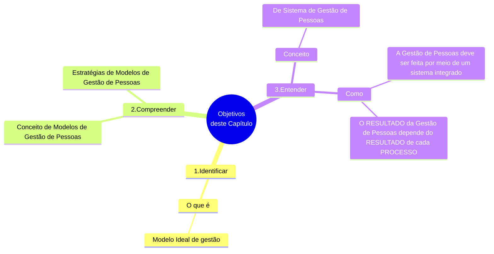

# Capítulo 01 - Gestão de Pessoas e Suas Atividades Básicas

## Objetivos do capítulo

## Introdução

- Gerir pessoas é:
  - **aproveitar as melhores habilidades** de cada um;
  - **motivar pessoas** para alcançarem um objetivo(s) comum(ns);
- De qualquer grupo social exerga-se a **importância** e surge a **preocupação** de **coordenar a capacidade de trabalho das pessoas**;
- Nos últimos 100 anos, a **preocupação** de **coordenar a capacidade de trabalho das pessoas** ganhou **teorias** e **estudos** especificos;
- Ambiente econômico mais complexo:
  - Empresas cada vez:
    - Maiores;
    - Numerosas;
    - Diversas;
  - Dificuldade de gerir pessoas de maneira intuitiva ou amadora;
  - Surgimento da **Gestão de Pessoas** como um **campo específico** de **atuação** e **pesquisa**;
    - Existe um **conjunto de atividades** <u>relacionadas às pessoas</u> que compõe a organização;
- **NÃO HÁ ORGANIZAÇÃO** <u>sem pessoas</u>;
- O **desempenho das pessoas** **OSCILA** na medida em que a **ORGANIZAÇÃO** demonstra:
  -  **COMPETÊNCIA** para:
     - **Prover** pessoas;
     - **Aplicar** pessoas;
     - **Manter** pessoas;
     - **Desenvolver** pessoas; e
     - **Monitorar** pessoas;
  - **ATIVIDADES DE GESTÃO** relacionada com a atividade de lidar com pessoas, respeitando suas características:
    - Físicas;
    - Psicológicas;
    - Culturais;
    - Sociológicas.

> "O **desempenho organizacional** é diretamente afetado pelo **desempenho das pessoas**.  
>  &nbsp;O **desempenho das pessoas** é diretamente relacionado com a forma que que a **organização** se relaciona com elas".

## Formulação estratégica de um modelo de gestão de pessoas

- Entende-se como certo, neste século, que **CRESCERÁ**:
  - A **INTERDEPENDÊNCIA** dos indivíduos;
  - A **INTERDEPENDÊNCIA** das organizações;
  - A **INTERDEPENDÊNCIA** na sociedade;
- A sociedade enfrentará **exigências** cada vez mais **crescentes** em atender **necessidades** cada vez mais **numerosas e complexas**;
  - A sociedade enfrentará **exigências** de atender a **um maior número** de necessidades cada vez mais **numerosas e complexas**;
  - A sociedade enfrentará **exigências** de atender de **novas formas** necessidades cada vez mais **numerosas e complexas**;
- A sociedade como um todo responderá a esses **desafios** (**necessidades** cada vez mais **numerosas e complexas**) através de uma das invenções humanas mais criativas: **AS ORGANIZAÇÕES**:
  - As **ORGANIZAÇÕES** estebelecem **OBJETIVOS**:
    - Para enfrentar **AS NECESSIDADES** da sociedade;
    - Para enfrentar **OS DESAFIOS** da sociedade;
  - As **ORGANIZAÇÕES** alcançam objetivos pelo **USO DE RECURSOS**;
  - As **ORGANIZAÇÕES** precisam **USAR SEUS RECURSOS** de modo mais eficiente possível (**MELHORAR AS ORGANIZAÇÕES**);
  - Quanto **melhor as ORGANIZAÇÕES funcionarem**, mas facilmente nossa sociedade poderá enfrentar os **desafios** e as **oportunidades** deste e dos próximos séculos;
  
<table id="nome-id-unico">
  <tr>
    <td align="center" width="140px">
       
      <b>Lembre-se</b>
    </td>
    <td valign="top">
      Nesta seção, é preciso lembrar que antes da organização definir OBJETIVOS, ela define uma FINALIDADE. Desse modo, convém sempre ter em mente que a organização define seus objetivos, sempre alinhados não só com as necessidades e oportunidades que existem, mas também com sua finalidade.
    </td>
  </tr>
</table>

- Existem muitas formas de efetuar a **Gestão de Pessoas** nas organizações;
- Poucos **modelos de Gestão de Pessoas** são introduzindos nas organizações à luz de uma **diretriz estratégica**;
- A **Gestão de Pessoas** surgiu, inicialmente, para:
  - Cumprimento de leis trabalhistas;
  - Adotar medidas de controle (principalmente, disciplinares);
- Um **BOM MODELO DE GESTÃO DE PESSOAS** significa:
  - Adotar **uma estratégia** de gestão de pessoas;
  - Adotar **uma estrutura** de gestão de pessoas;
  - Adotar **um sistema** de gestão de pessoas;
- **Organizações bem geridas** são aquelas que **adotam modelos apropriados** para a **gestão de todos os recursos**, <u>inclusive para a Gestão de Pessoas</u>;
- Geralmente, **MODELOS DE GESTÃO** são adotados a partir de definições estratégicas;
  - Devem ser adotados de forma:
    - A levarem as pessoas a conhecerem os **OBJETIVOS ESTRATÉGICOS DA ORGANIZAÇÃO**;
    - A dominarem técnicas de trabalho
    - A saberrem onde e como prover melhorias
    - A identificarem sua contribuição para os resultados finais;
    - A compreenderem os impactos produzidos por sua atuação;

São **REQUISITOS** de um **modelo de gestão de pessoas** **BEM DEFINIDO** e **BEM ESTRUTURADO** requer:

1. Definição dos **objetivos** estratégicos da gestão de pessoas;
2. **Domínio e utilização das técnicas** específicas para a Gestão de Pessoas;
3. Quem **sejam conhecidas** as **metodologia** apropriadas para **melhorias contínuas** relacionadas à Gestão de Pessoas;
4. Quem **sejam conhecidas** as oportunidades para **melhorias contínuas** relacionadas à Gestão de Pessoas;
5. Que seja possível a **identificação clara e objetiva** da **contribuição da gestão de pessoas** para os **resultados finais da organização**;
6. Que haja **compreensão dos impactos** produzidos pela **atuação da gestão de pessoas** em **toda a organização**;

Um **modelo de gestão de pessoas** **BEM DEFINIDO** e **BEM ESTRUTURADO** auxilia os responsáveis pela organização para o grande desafio de manter os colaboradores trabalhando:

- Como uma verdadeira equipe;
- Com objetivos bem definidos;
- Cada qual conhecendo e desempenhando o seu papel
- Interagindo com todos os processos da organização;
- Para atingir os objetivos previstos pelo plano estratégico
- A fim de que a organização passe a percenter ao grupo de organizações no futuro;
  
## Modelo de gestão de pessoas ideal

## A relação e as interfaces dos processos do sistema de gestão de pessoas

## Fontes de Informações

- Associação Brasileira de Recursos Humanos (ABRH)

## Referências bibliográficas
