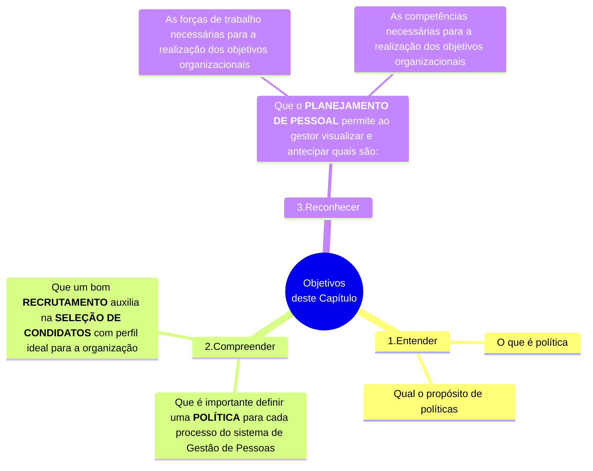

# Capítulo 02 - Políticas de Gestão de Pessoas e Planejamento de Pessoal

## Objetivos do capítulo

## Introdução - Inicie sua jornada

- As políticas:
  - Buscam conseguir **uniformidade**, economias, benefícios de relações públicas e outros objetivos que não se relacionam à Gestão de Pessoas;
  - **Cada organização possui** a sua **cultura**, a sua **forma de pensar**, de **agir** e, por conseguinte, as **suas políticas**.
- A partir das políticas:
  - É possível definir os **PROCEDIMENTOS** a serem implantados, que são **CURSOS DE AÇÃO** predeterminados:
    - Para orientar o **DESEMPENHO DAS OPERAÇÕES**, tendo em vista os **objetivos da organização**;
    - Para orientar as **ATIVIDADES**, tendo em vista os **objetivos da organização**;
- Os **PROCEDIMENTOS** constituem uma **espécie de plano permanente**, que serve para orientar as pessoas na execução de suas **tarefas** dentro da organização;
  - Servem para **guiar** as pessoas na realização dos objetivos organizacionais;
  - Visam dar consistência à execução das atividades;

<table id="nome-id-unico">
  <tr>
    <td align="center" width="140px">
       
      <b>Lembre-se</b>
    </td>
    <td valign="top">
      Lorem ipsum lorem ipsum.
    </td>
  </tr>
</table>

## Desenvolva seu potencial

### Políticas para PROCESSO DE PROVISÃO

- É recomendável que as políticas sejam **definidas** com a **participação dos colaboradores**;
- Algumas organizações formam **COMITÊS** para auxiliar na definição das políticas;
- A partir da **definição das políticas**, é muito importante transcrevê-las em um
**MANUAL**, que deve ser **utilizado** em **todos os níveis da organização**;
- A gestão de pessoas é um processo muito complexo e, dessa forma, é muito auxiliado por:
  - Políticas **BEM DEFINIDAS**;
  - Políticas **BEM DIVULGADAS**;

### Políticas para o planejamento de pessoal

- Busca-se critérios

### Políticas para recrutamento

- Determinam quais **CRITÉRIOS**:
  - Para definir **ONDE RECRUTAR** pessoal;
  - Quais **FONTES DE RECRUTAMENTO** e em que locais, internas ou externas, devem ser utilizadas;
  - Em que **CONDIÇÕES** recrutar?
  - **COMO** recrutar ?
  - Quais **TÉCNICAS DE RECRUTAMENTO** utilizar ?

### Políticas para seleção

- Busca-se determinar quais **CRITÉRIOS** para:
  - Padrão de qualidade está se buscando num candidato;
  - Aptidões físicas;
  - Aptidões intelectuais;
  - Experiência;
  - Potencial de desenvolvimento;
- Busca-se integrar **NOVOS PARTICIPANTES** ao ambiente interno da organização com **RAPIDEZ** e **EFICÁCIA**.

### Políticas de aplicação

- Busca-se determinar **REQUISITOS BÁSICOS** para o **desempenho de tarefas** e **atribuições dos cargos** da organização;
- Busca-se **CRITÉRIOS** para:
  - Planejamento de recursos humanos;
  - Alocação de recursos humanos;
  - Movimentação interna de recursos humanos;
- Considera-se:
  - Posicionamento inicial;
  - Plano de carreiras;
- Define-se **CRITÉRIOS** para:
  - Avaliação da qualidade;
  - **Adequação dos recursos humanos** por meio da **avaliação de desempenho**;

### Política para PROCESSO DE MANUTENÇÃO

- Determina **CRITÉRIOS** de como executar atividades relacionadas à política de manutenção;
  - Remuneração direta dos colaboradores
    - Considera a posição na organização frente a dois elementos:
      - Avaliação do cargo
      - Salários de mercado
  - Remuneração indireta dos colaboradores
    - Programa de benefícios sociais
    - Como manter a força de trabalho:
      - Motivada
      - Com o moral elevado;
      - Participativa
      - Produtiva
      - Em um clima organizacional adequado;
  - Condições físicas ambientais de higiene e segurança

### Políticas para PROCESSO DE DESENVOLVIMENTO

- Busca-se **CRITÉRIOS** para:
  - Diagnóstico e programação
    - Para **preparação e reciclagem** permanente da força de trabalho (tarefas e atribuições)
  - Desenvolvimento de recursos humanos (médio e longo prazo)
    - Visando contínua realização do potencial humano em posições gradativamente elevadas
  - Desenvolvimento de condições
    - Para **garantir** por meio da **MUDANÇA DE COMPORTAMENTO** dos colaboradores da organização:
      - Saúde organizacional
      - Excelência organizacional

### Políticas para PROCESSO DE MONITORAÇÃO

- Auxilia a manter um **BANCO DE DADOS** capaz de **fornecer informações**:
  - Para análises qualitativas e quantitativas da **força de trabalho** disponível;
  - Para análise com critérios para auditoria permanente:
    - Da aplicação e adequação das **POLÍTICAS** relacionados com Gestão de Pessoas;
    - Da aplicação e adequação dos **PROCEDIMENTOS** relacionados com Gestão de Pessoas;

## Analisar as metas e históricos

- O planejamento de Pessoal
  - **PREVÊ** as **OFERTAS** e **DEMANDAS** futuras de colaboradores na organização;
  - **PERMITE** que especialistas providenciem a **FORÇA DE TRABALHO** apropriada para organização;
  - Serve como GUIA para as atividades de Gestão de Pessoas;
- Todas as organizações **DEVEM**:
  -  **IDENTIFICAR SUAS NECESSIDADES DE COLABORADORES**:
    - Por meio de planejamento de **curto** e **longo** prazo;
      - Planejamento de **CURTO PRAZO**:
        - Vagas que precisam ser preenchidas **DURANTE O PRÓXIMO ANO**;
      - Planejamento de **LONGO PRAZO**:
        - Estimam a situação de recursos humanos para **DOIS**, **TRÊS** ou **CINCO** anos no futuro;
- **ANALISAR METAS** que afetem as **NECESSIDADES DE PESSOAL**:
  - Volume de vendas;
  - Produção de serviços;
- **ANALISAR HISTÓRICOS** para cada uma das **METAS**;
- **PROJETAR**, correlacionada com os **NÍVEIS HISTÓRICOS**:
  -  **NÍVEIS FUTUROS** de **METAS**;
  -  **MÃO DE OBRA** para cada área da organização

<table id="nome-id-unico">
  <tr>
    <td align="center" width="140px">
       
      <b>Lembre-se</b>
    </td>
    <td valign="top">
      A atividade de planejamento requer habilidade de análise de diferentes variáveis que facilitem a tomada de decisão.
    </td>
  </tr>
</table>

<table id="nome-id-unico">
  <tr>
    <td align="center" width="140px">
       
      <b>Lembre-se</b>
    </td>
    <td valign="top">
      São dicas para análise:
      <ol>
      <li>Analisar metas e históricos;</li>
      <li>Dimensionar a necessidades de pessoas e a capacidade instalada;</li>
      <li>Analisar histórico de movimentação de psssoas</li>
      <li>Analisar plano de carreira de colaboradores</li>
      <li>Analisar planos de sucessão de colaboradores</li>
      </ol>
    </td>
  </tr>
</table>

## Dimensionar a necessidade de pessoas x a capacidade instalada

- Busca o equilíbro entre o **NÚMERO DE PESSOAS** e a **PROCURA/DEMANDA** do **produto/serviço**;
  - Relaciona-se com a variável **MÃO DE OBRA DIRETAMENTE ENVOLVIDA NA PRODUÇÃO (MDP)**;
- Está voltado para o **nível operacional** da organização;
- Compete, geralmente, ao **PLANEJAMENTO E CONTROLE DA PRODUÇÃO (PCP)**:
  - **DEFINIR** a **NECESSIDADES DE PESSOAS** para cumprir os **programas de produção**;
  - **INFORMAR** à Gestão de Pessoas essa necessidade para **RECRUTAMENTO** e **SELEÇÃO**;

## Analisar históricos de movimentação de pessoal

- É **NECESSÁRIO MANTER**:
  - Um **HISTÓRICO** de movimentação de pessoal
  - Um **ACOMPANHAMENTO** de movimentação de pessoal
- A movimentação de pessoal **ENVOLVE** analisar **FLUXOS**:
  - De **ENTRADA** de pessoal;
  - De **SAÍDA** de pessoal;
  - De **PROMOÇÃO** de pessoal
  - De **TRANSFERÊNCIA INTERNA / RELOTAÇÃO** de pessoal
- A análise desses fluxos:
  - Permite **PREDIÇÃO** a curto prazo das necessidades de pessoal
  - É muito **útil na análise** do **SISTEMA DE CARREIRAS** quando a organização adota uma política consistente nesse sentido;

## Analisar os planos de carreira e sucessão de funcionários

## Novos desafios
  
## Fontes de Informações

(...)

## Referências bibliográficas

[^CHIAVENATO-2000]: CHIAVENATO, Idalberto. Administração de Recursos Humanos. São Paulo: Makron Books, 2000
