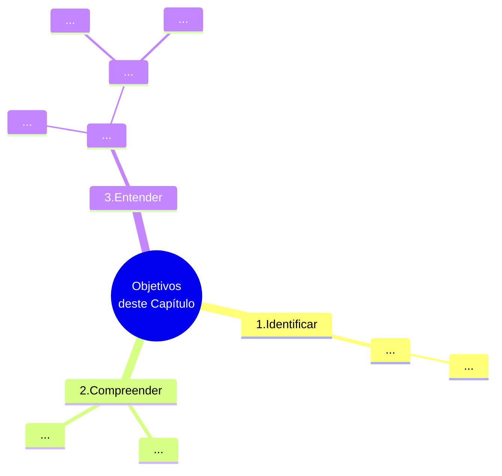

# Capítulo 02 - Políticas de Gestão de Pessoas e Planejamento de Pessoal

## Objetivos do capítulo

## Introdução - Inicie sua jornada

## Desenvolva seu pessoal

### Políticas para processo de provisão

  
<table id="nome-id-unico">
  <tr>
    <td align="center" width="140px">
       
      <b>Lembre-se</b>
    </td>
    <td valign="top">
      Lorem ipsum lorem ipsum.
    </td>
  </tr>
</table>

### Políticas para o Planejamento de pessoal

### Políticas para recrutamento

### Políticas para seleção

### Políticas de aplicação

### Política de manutenção

### Políticas de desenvolvimento

### Políticas de Monitoração

## Analisar as metas e históricos

## Dimensionar a necessidade de pessoas x a capacidade instalada

## Analisar históricos de movimentação de pessoal

## Analisar os planos de carreira e sucessão de funcionários

## Novos desafios
  
## Fontes de Informações

(...)

## Referências bibliográficas

[^CHIAVENATO-2000]: CHIAVENATO, Idalberto. Administração de Recursos Humanos. São Paulo: Makron Books, 2000
