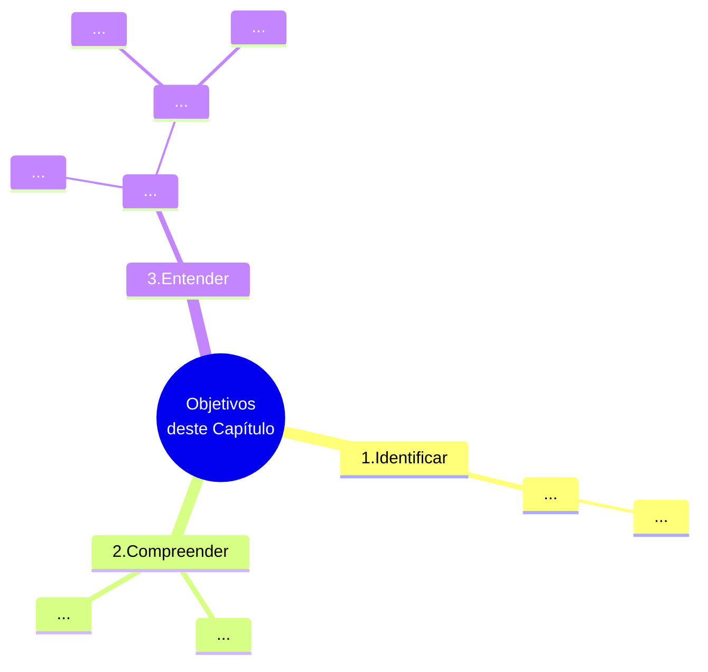

# Capítulo 03 - Processo de Recrutamento e Seleção de Pessoal

## Objetivos do capítulo

## Introdução - Inicie sua jornada

## Desenvolva seu pessoal

### Recrutamento e desenho de cargos

  
<table id="nome-id-unico">
  <tr>
    <td align="center" width="140px">
       
      <b>Lembre-se</b>
    </td>
    <td valign="top">
      Nesta seção, é preciso lembrar que antes da organização definir OBJETIVOS, ela define uma FINALIDADE. Desse modo, convém sempre ter em mente que a organização define seus objetivos, sempre alinhados não só com as necessidades e oportunidades que existem, mas também com sua finalidade.
    </td>
  </tr>
</table>

### Recrutamento e mercado de recursos humanos

## Recrutamento e suas técnicas e procedimentos

## Recrutamento interno

## Recrutamento externo

## Recrutamento misto

## Seleção de pessoal

### Processo de seleção

### Técnicas para avaliação de candidatos

#### Entrevista

#### Provas de conhecimentos ou de capacidades

#### Técnicas de simulação

#### Testes psicométricos

#### Testes de personalidade

## Novos desafios
  
## Fontes de Informações

(...)

## Referências bibliográficas

[^CHIAVENATO-2000]: CHIAVENATO, Idalberto. Administração de Recursos Humanos. São Paulo: Makron Books, 2000

[^CHIAVENATO-2000a]: CHIAVENATO, Idalberto. Administração de Recursos Humanos. São Paulo: Makron Books, 2000.

[^CHIAVENATO-2000b]: CHIAVENATO, Idalberto. Como Transformar RH (de um Centro de despesa) em um Centro de Lucro. São Paulo: Makron Books, 2000.

[^CHIAVENATO-2004]: CHIAVENATO, Idalberto. Gestão de Pessoas: o novo papel de recursos humanos nas organizações. Rio de Janeiro: Campus, 2004.

[^CHIAVENATO-2007]: CHIAVENATO, Idalberto. Administração de Recursos Humanos: fundamentos básicos. São Paulo: Atlas, 2007.

[^CHIAVENATO-2008]: CHIAVENATO, Idalberto. Empreendedorismo: dando asas ao espírito. Rio de Janeiro: Saraiva, 2008. 

[^CHIAVENATO-2009]: CHIAVENATO, Idalberto. Recursos Humanos: o capital humano das organizações. 9. ed. Rio de Janeiro: Elsevier, 2009
