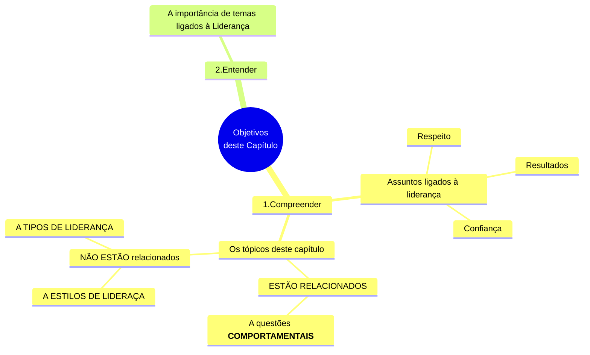
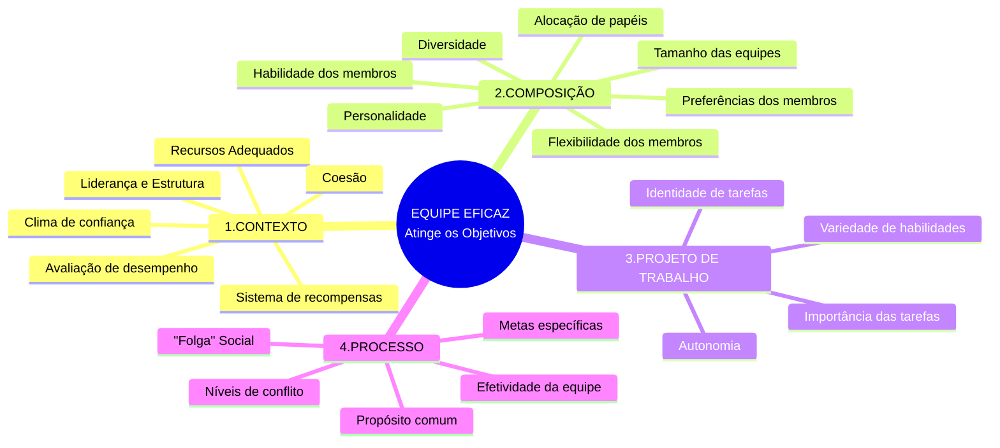
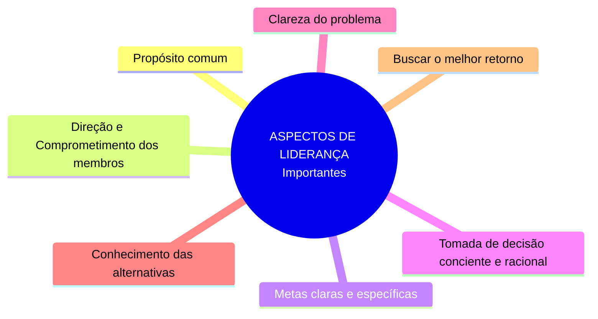
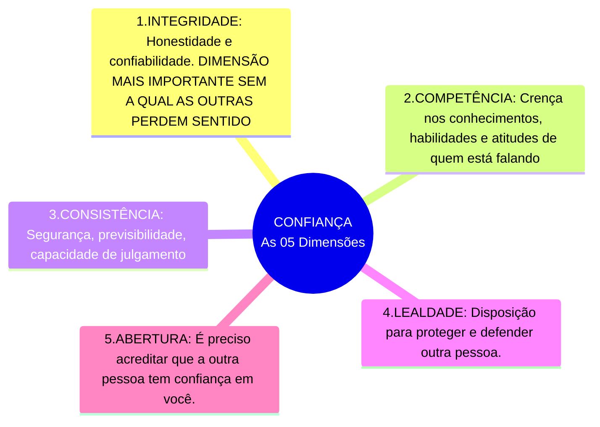
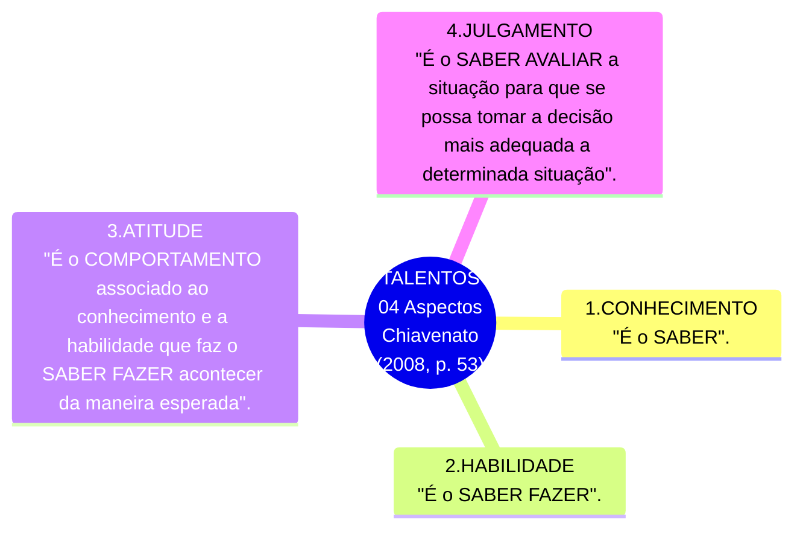
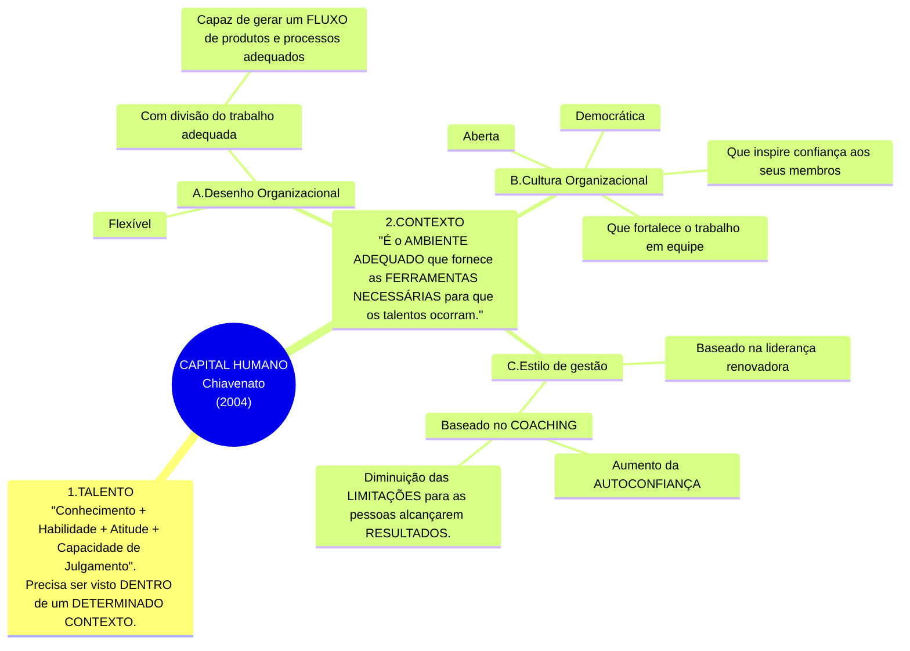
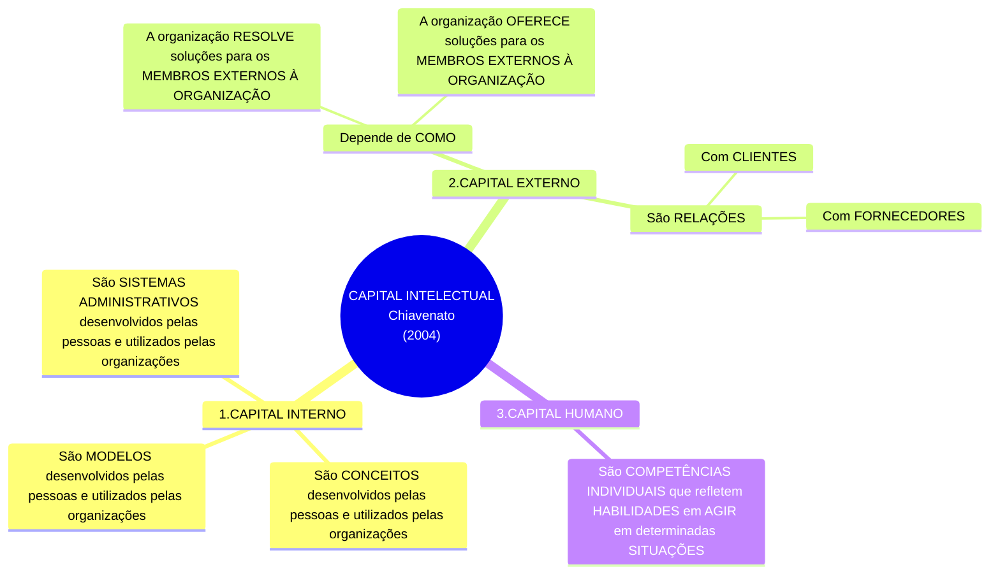

# Capítulo 09 - Novos Caminhos sobre a Liderança nas Organizações

## Objetivos do capítulo

## Introdução - Inicie sua jornada

- Serão abordadas questões comportamentais **corelacionadas** à liderança;
- NÃO SERÃO abordados tópicos relacionados **diretamente** a:
  - Estilos de liderança;
  - Tipos de liderança;
  
## Liderança, Resultados e Confiança

- É por meio do LÍDER e seus LIDERADOS que os **RESULTADOS** acontecem;
- Trabalhar em equipe traz melhores **RESULTADOS**:
  - Quando a **TAREFA** a ser desenvolvida **requer múltiplas** **COMPETÊNCIAS** e **EXPERIÊNCIAS**;

- **EQUIPE EFICAZ**:
  - Tem confiança nela mesma; e
  - Acredita que vai alcançar aquilo que lhe foi proposto
- Um **LÍDER PRECISA**:
  - Ter Visão sistêmica;
  - Saber analisar alternativas;
  - Tomar a decisão mais adequada;

<table id="definicao-visao-sistemica">
  <tr>
    <td align="center" width="140px">
       
      <b>Definição</b>
    </td>
    <td valign="top">
      Para Soares (2015, p. 89), <b>VISÃO SISTÊMICA</b> é a capacidade de:  
      <ul>
        <li>Avaliar os ACONTECIMENTOS ao redor</li>
        <li>Avaliar suas possíveis IMPLICAÇÕES</li>
        <li>Criar um SOLUÇÃO ÚNICA que possa atender da melhor forma ao maior número de expectativas das partes interessadas</li>
      </ul>
    </td>
  </tr>
</table>

- CONFIANÇA:
  - É um processo;
  - É a relação em que as partes têm convicção de que ambos NÃO VÃO AGIR de forma OPORTUNISTA, tirando vantagem da situação;
  - Depende da reputação;
  - Depende de um relacionamento de LONGO PRAZO (somente com o tempo);
  - Ajuda as pessoas:
    - A assumirem RISCOS;
    - A melhorarem o PROCESSO;
- CONFIABILIDADE DO LÍDER:
  - Integridade;
  - Benevolência;
  - Capacidade.
- Quando confiamos em alguém:
  - Assumimos o risco de ficar vulnerável em um determinado processo;
  - Nos expomos a um risco;

## A liderança a partir do desenvolvimento de talentos

- Principal **RECURSO** para desenvolvimento HUMANO e ORGANIZACIONAL é o **CONHECIMENTO**;
- É preciso TRANSFORMAR o que cada um tem de melhor em ALGO A SER UTILIZADO pela organização;
- Para Dessler (2003, p. 15), a área de recursos humanos é fonte de **VANTAGEM COMPETITIVA**;
  - Diferenciais Individuais;
  - Diferenciais organizacionais;
- Para alcançar e se manter com VANTAGEM COMPETITIVA, os recursos humanos organizacionais precisam:
  - Estar em constante APRENDIZADO;
  - Ser destinatários de INVESTIMENTOS EM EDUCAÇÃO (recursos pessoais ou organizacionais);
  - Ser destinatários de APRIMORAMENTOS;
- Um LÍDER precisa GERENCIAR TALENTOS para que a organização alcance o sucesso;

#### Talentos

- Segundo Chiavenato (2008,p. 53), o TALENTO envolve 04 ASPECTOS:

<b>Mapa Mental:</b> Os 04 Aspectos que envolvem o TALENTO segundo Chiavenato(2008, p. 53)

<b>Fonte:</b> Próprio autor, a partir do texto do livro

- **TALENTO HUMANO** é um dos elementos do **CAPITAL HUMANO**:

#### Capital Humano

<b>Mapa Mental:</b> Os elementos do CAPITAL HUMANO, segundo Chiavenato(2004)

<b>Fonte:</b> Próprio autor, a partir do texto do livro

#### Capital Intelectual

- Para Chiavenato(1999, p. 419):
  - CAPITAL INTELECTUAL é a SOMA de TUDO O QUE VOCÊ SABE;
  - CAPITAL INTELECTUAL é o MAIOR PATRIMÔNIO organizacional ( **CONHECIMENTO QUE AS PESSOAS TRAZEM EM SUAS MENTES** )
    - Conhecimentos sobre PRODUTOS;
    - Conhecimentos sobre SERVIÇOS;
    - Conhecimentos sobre CLIENTES;
    - Conhecimentos sobre PROCESSOS;
    - Conhecimentos sobre TÉCNICAS;
  - Ter as **PESSOAS CERTAS** e saber APLICÁ-LAS, MANTÊ-LAS e MONITORÁ-LAS é vital para as organizações;

<b>Mapa Mental:</b> Elementos do CAPITAL INTELECTUAL

<b>Fonte:</b> Próprio autor, a partir do texto do livro

#### Como deve ser o foco das organizações ?

- O foco das Organizações DEVE estar no GERENCIAMENTO DO CAPITAL INTELECTUAL ( Recurso mais Valioso da Organização )
  - INVESTIR constantemente em APRENDIZADO;
  - AJUDAR o CONSTANTE processo de MUDANÇA ORGANIZACIONAL
  - DIMINUIR a RESISTÊNCIA À MUDANÇA
  - AUMENTAR a INOVAÇÃO;
  - AUMENTAR a CRIATIVIDADE das pessoas;

## O papel da LIDERANÇA como DIFERENCIAL COMPETITIVO

- Em razão de um mercado cada vez mais COMPETITIVO e GLOBALIZADO:
  - As organizações precisam
    - Se adaptar rapidamente;
    - Atender a uma demanda cada vez mais exigente;
    - Incrementar a COMPETITIVIDADE por uma questão de SOBREVIVÊNCIA;
    - Reduzir CUSTOS;
    - Melhorar PRODUTOS;
    - Investir em TECNOLOGIA

## Conceito de Estratégia

- Vem do grego _strategos_
  - Significa a arte ou a ciência de ser um general;
  - Na Grécia antiga, os generais lideravam seus exércitos com estratégia;
    - Nesse contexto, **ESTRATÉGIA** era definida como o padrão real das ações que ele empreendia ao inimigo;

<table id="quadro-definicao-estrategia-almeida-neto-giraldi-2006">
  <tr>
    <td align="center" width="140px">
       
      <b>Definição</b>
    </td>
    <td valign="top">
     Segundo <b>Almeida, Neto e Giraldi (2006)</b>: Estratégia é a identificação1 e o estabelecimento**2** de um <b>conjunto de OBJETIVOS e METAS</b>, por meio de <b>RECURSOS</b> e <b>COMPETÊNCIAS</b>, considerando: 
     <ul>
       <li>As FORÇAS DO AMBIENTE EXTERNO;</li>
       <li>A VONTADE DE SEUS DIRIGENTES;</li>
       <li>CRITÉRIOS DE DECISÃO;</li>
       <li>AÇÃO de CONCORRENTES; e</li>
       <li>AÇÃO das FORÇAS COMPETITIVAS;</li>
     <ul>
    </td>
  </tr>
</table>

<table id="quadro-definicao-estrategia-mintzberg-quinn-2001">
  <tr>
    <td align="center" width="140px">
       
      <b>Definição</b>
    </td>
    <td valign="top">
     Segundo <b>Mintzberg e Quinn (2001)</b>: Estratégia é <b>UM PADRÃO</b> ou <b>PLANO</b>: 
      <ul>
      <li>Que se une às <b>principais metas</b> da empresa;</li>
      <li>para alocar os recursos para alcançar <b>um objetivo comum</b>;</li>
      <li>tendo como <b>BASE</b>, para <b>SE ANTECIPAR AOS ACONTECIMENTOS</b>:</li>
      <ul>
        <li>As competências internas;</li>
        <li>Ameaças;</li>
        <li>Oportunidades do ambiente externo.</li>
      </ul>
      <ul>
    </td>
  </tr>
</table>

- Ainda para Mintzberg e Quinn (2001), uma **ESTRATÉGIA BEM-SUCEDIDA** contém **TRÊS ELEMENTOS ESSENCIAIS**:
  - **META** a ser atingida;
  - **POLÍTICAS** que orientam ações;
  - **PROVIDÊNCIAS** sequenciais para atingir a meta ou objetivo;
- Qual o OBJETIVO DA ESTRATÉGIA ? Por que a ESTRATÉGIA existe ?
  - Para MANTER a empresa no mercado;
  - Para DIFERENCIAR a empresa dos concorrentes;
  - Para fazer a empresa EMERGIR num mercado cada vez mais competitivo (maior participação no mercado em que atua);

## Estratégia e Competências Organizacionais

- O CAMINHO para **VANTEGEM COMPETIVIVA**1 e o **DIRECIONAMENTO DA ESTRATÉGIA**2 da organização são delineados:
  - Pelas COMPETÊNCIAS ORGANIZACIONAIS;
  - Pelo APRENDIZADO;
  - Pelo TALENTO das pessoas que atuam na organização;
- 

## Novos desafios

  
## Fontes de informações

(...)

## Referências bibliográficas

ALMEIDA, F. C.; NETO, A. J. M.; GIRALDI, J. de M. E. Estrutura e estratégia: evolução de paradigma. Revista de Gestão USP, São Paulo, v. 13, n. 2, p. 15-26, abr./jun. 2006.

CHIAVENATO, I. Gestão de pessoas: o novo papel dos recursos humanos nas organizações. Rio de Janeiro: Elsevier, 1999.

CHIAVENATO, I. Gestão de pessoas: e o novo papel dos recursos humanos nas organizações. 3. ed. Rio de Janeiro: Elsevier, 2004.

CHIAVENATO, I. Novos paradigmas: como as mudanças estão mexendo com as empresas. 5. ed. rev. e atual. São Paulo: Manole, 2008.

DESSLER, G. Administração de recursos humanos. 2. ed. São Paulo: Prentice Hall, 2003.

FLEURY, M. T. L.; FLEURY, A. C. C. Alinhando estratégia e competências. RAE, São Paulo, v.44, n. 1, p. 44-57, jan./mar. 2004.

KLOTZLE, M. C. Alianças estratégicas: conceito e teoria. Revista de Administração Contemporânea, Maringá, v. 6, n. 1, p. 85-104, jan./abr. 2002.

MINTZBERG, H.; QUINN, J. B. O processo da estratégia. 3. ed. Porto Alegre: Bookman,2001.

MOURA, M. C. C.; BITENCOURT, C. C. B. Articulação entre estratégia e o desenvolvimento de competências gerenciais. RAE, São Paulo, v. 5, n. 1, Art. 3, jan./jun. 2006.

NELSON, D. L.; QUICK, J. C. Comportamento organizacional. São Paulo: Cenagage Learning, 2012.

PICCHIAI, D. Estratégia, estrutura e competências gerenciais: estudo de uma operadora de plano de saúde, modalidade autogestão. Revista de Ciências da Administração, Florianópolis, v. 11, n. 25, p. 209-228, set./dez. 2009.

PORTER, M. E. Estratégia competitiva. São Paulo: Campus, 1986.

PRAHALAD, C. K.; HAMEL G. The core competence of the corporation. Harvard Business Review, Boston, v. 68, n. 3, p. 79–91, 1990.

PRAHALAD, C. K.; HAMEL, G. Competindo pelo futuro: estratégias inovadoras para obter o controle do seu setor e criar os mercados de amanhã. Rio de Janeiro: Campus, 1995.

SOARES, M. T. R. C. Liderança e desenvolvimento de equipes. São Paulo: Pearson Education do Brasil, 2015.

IBC COACHING. O que é coaching ? Disponível Em: http://www.ibccoaching.com.br/tudo-sobre-coaching/coaching/o-que-e-coa-ching/ Acesso em: 5 mar. 2015.
